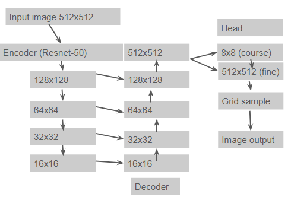
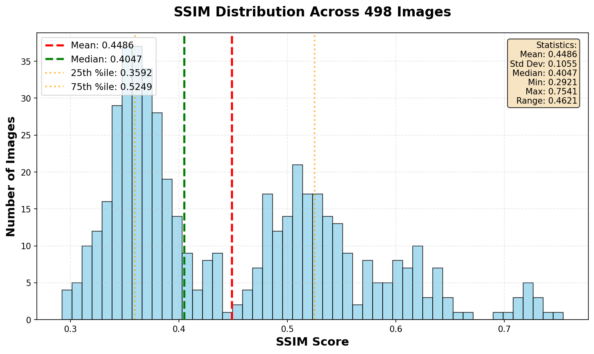
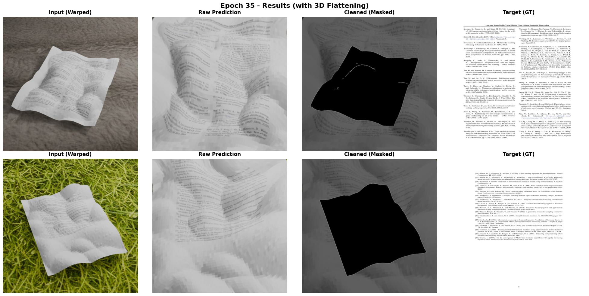
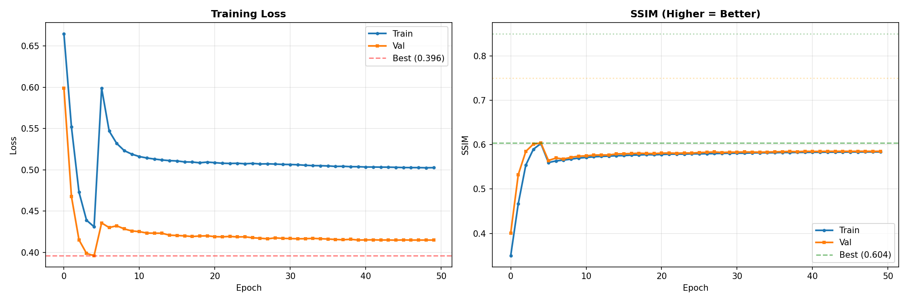

Document Unwarping Project Report

This project implements a deep learning-based document unwarping system that predicts UV coordinate fields to geometrically rectify warped/curved document images. The model uses a two stage coarse to fine approach with progressive loss scheduling for robust training. It doesn't work as well as expected, but text is semi readable. I feel like if I had more compute power and time I would have been more successful.

Evaluate Usage: python ./evaluate.py --checkpoint --data_dir renders\synthetic_data_pitch_sweep
Example: python ./evaluate.py --checkpoint best_model.pth --data_dir renders\synthetic_data_pitch_sweep

Inference Usage: python inference.py --input --output --checkpoint
Example: python inference.py --input renders\synthetic_data_pitch_sweep\rgb  --output results/ --checkpoint best_model.pth

Input / Output Definition

- Input: RGB image B×3×512×512 of warped document
- Output 1: Rectified RGB image B×3×512×512
- Output 2: Dense UV field B×2×512×512
- UV semantics: Backward mapping (output → input), normalized to [0,1]

Architecture:

Shown in image:

Utilizes U-net style encoder and decoder combined with a two way warping strategy as the head.

Key model components:
- Encoder: backbone from ResNet50
- Normalization: GroupNorm (stable for small batches)
- UV Prediction: Tanh bounded residuals clamped to [0,1]
- Warping: Bilinear grid sampling with border padding
- Head:
    - Coarse: operates on downsampled features (8x8) for large deformations
    - Fine: operates on full resolution features (512x512) for predicting residual corrections ie. small details
    - Final field is the combination of these

What is the model predicting? 
- It is NOT outputting a rectified image. It is outputting a geometric mapping called UV grid.
- How I think of it conceptually is: "as an output pixel, where in the input do I come from?"
    - Backwards warping
- To get output images, differentiable unwarping is performed via backward sampling using "grid_sample", where each output pixel queries a location in the input image defined by the predicted UV coordinates

Loss function
- Primary loss: a masked SSIM
    - This makes sense because it aligns with human intuition, ie. isolating the page from the background
    - Found it was better for capturing structure while maintaining text clarity
Implementation: custom SSIM with mask weighting to focus just on the document regions
- I found that often the model would cheat and boost SSIM artificially by modifying the background. This makes that impossible.

Geometric regularization losses
1. Total Variation (TV) Smoothness (was popular online)
    - Weight: .03
    - Start: Epoch 3 ramped over 3 epochs
    - Purpose: Penalizes sharp discontinuities in UV field
2. Fold Prevention
    - Weight: .5
    - Start: Epoch 6
    - Purpose: Penalizes negative Jacobian determinants (ie. folding)
    - Method: Hinge loss on det(J) with epsilon threshold (0.2)
3. Hinge pass gradient loss
    - Weight: .15
    - Start: Epoch 6
    - Purpose: Preserves fine text details by matching edge gradients
    - Method: Sobel filter edge comparison
4. Source Paper Coverage
    - Weight: 0.2 ramped over 10 epochs
    - Start: Epoch 0 
    - Purpose: Ensures full document is visible in output (no cropping which was originally a BIG problem)
    - Method: Penalizes unmapped source regions via warped mask
5. UV Supervision
    - Weight: 0.1
    - Start: Epoch 3 ramped over 3 epochs
    - Purpose: Direct supervision from ground truth UV maps
3D Flattening Losses (attempt to smooth more -- wasn't super successful)
6. Area Preservation
    - Weight: 0.02 --> 0.2, ramped over 27 epochs, 10× multiplier
    - Start: Epoch 3
    - Purpose: Prevents non-uniform stretching (I called them "lumps")
    - Method: Minimizes variance of |det(Jacobian)| across document
7. Laplacian Smoothness
    - Weight: 0.01 --> 0.1, ramped over 27 epochs, 10× multiplier
    - Start: Epoch 3
    - Purpose: Reduces local curvature in UV field
    - Method: Penalizes discrete Laplacian 

Progressive Loss Schedule -- I wanted the model to learn geometry first before worrying about detail
- Epochs 1-2: Reconstruction only
- Epoch 3+: + TV + UV supervision + 3D flattening
- Epoch 6+: + Fold prevention + High-pass gradients

____________________________________________________

Dataset:
- rgb/: warped input document images
- ground_truth/: flat document textures
- uv/: ground truth UV maps (used for optional supervision)
- border/: binary document masks used for loss masking
____________________________________________________
Results: 

Best Validation: ~.59 - 6 Masked SSIM
About Average SSIM: Slightly misleading because even if an SSIM is high, it might not be readable (was playing around with that). I felt like there was a sacrifice between high SSIM (similar structural similarity) and clarity of the words.

Training Curves:
- Loss: Steady decrease with occasional spike during other loss introduction
- SSIM: Progressive improvement until Epoch 30 (other than early spike before detail gets involved)

____________________________________________
Future Work and Unimplemented Features
The following features were designed but disabled in the final config due to time constraints:

1. Curvature-Weighted Fold Loss

Config Flag: use_curvature_fold = False
Concept: Weight fold penalties by local curvature magnitude
Goal: Prevent folds specifically in high-curvature regions (lumps)
Status: Implemented but not thoroughly tested

2. UV Attention Mechanism

Config Flag: use_attention = False (in model)
Concept: Learnable attention weights to focus UV prediction on important regions
Implementation: Sigmoid gated channel wise attention on UV features
Status: Code exists but disabled for training stability

3. Learnable UV Bias

Config Flag: use_uv_bias = False (in model)
Concept: Global learnable offset for UV coordinates
Goal: Compensate for systematic prediction biases
Status: Implemented as nn.Parameter but not activated

4. Post-Warp Refinement Network

Config Flag: use_post_refine = False (in model)
Concept: Small CNN to refine warped output (reduce artifacts)
Architecture: 3-layer conv network with residual connection
Status: Implemented with zero-initialized weights but disabled

_____________________________

Conclusions:

Failures:
- Severe folding: UV field produces local self-intersections
- Boundary Errors: mask inaccuracies cause UV extrapolation near edges
- Colab crashing and me losing my training script :(

Key Insights:
1. Progressive ramping is critical: Introducing all losses at once causes training collapse
2. 3D flattening helps: Area preservation and Laplacian smoothness reduce "lumps" -- not sure how to fully smooth out the "lumps" though
3. Masked metrics matter: Ignoring background prevents overfitting to borders
4. Residual UV is stable: Predicting offsets from identity grid trains faster than absolute coordinates

